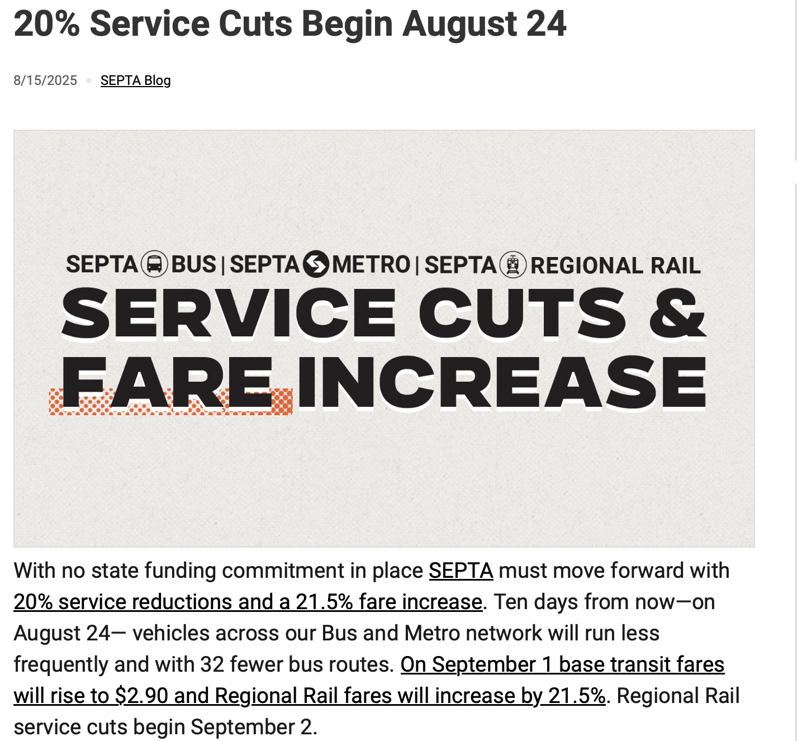
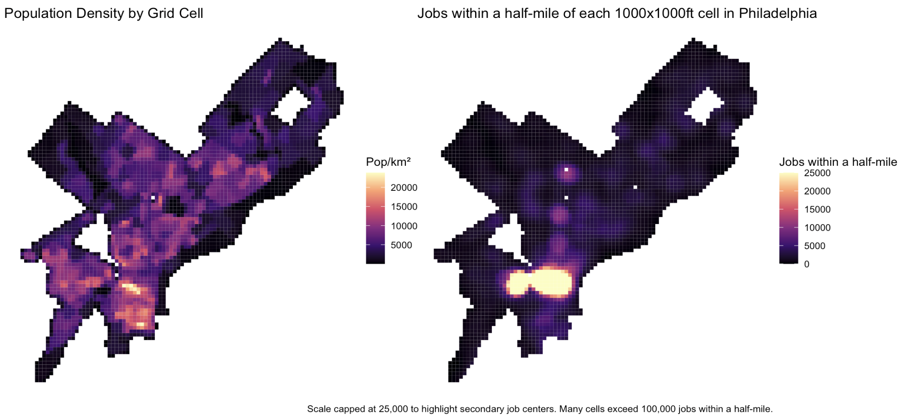
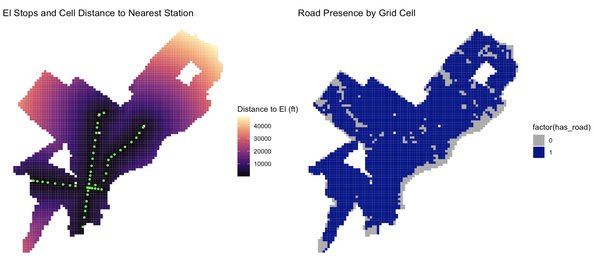
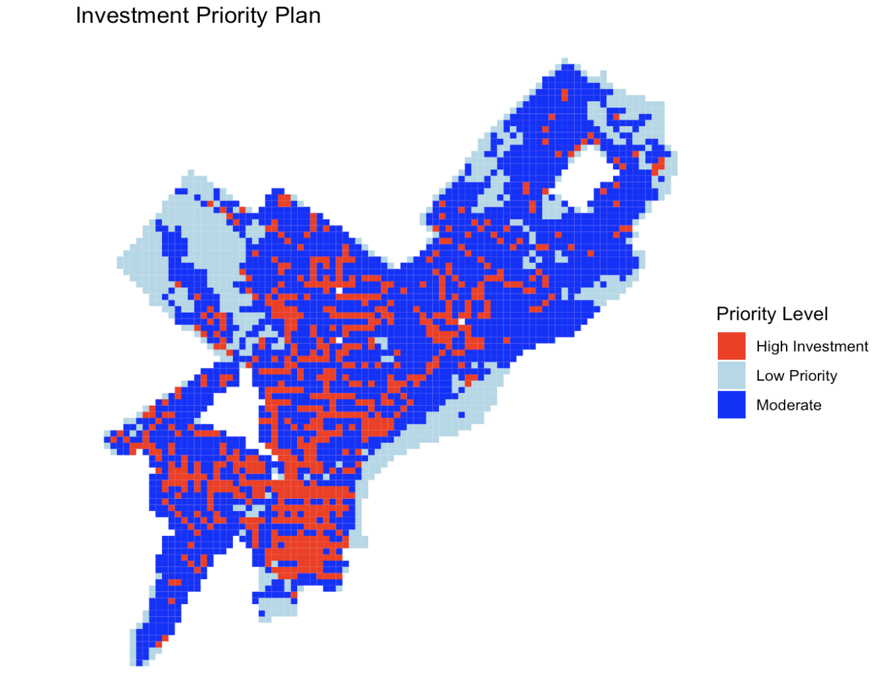

## Policy Problem and Context

**Based on predicted ridership, which parts of Philadelphia should SEPTA invest more or less resources?**

-   Better service riders in underserved areas
-   Optimize efficiency to conserve funding during SEPTA's current fiscal crisis

```{r}
#| echo: false
#| fig-align: center
#| out-width: "100%"

```

## Data Sources

**SEPTA Bus Stop Summaries** — Fall Season

-   2022, 2023, 2024, 2025

**Why only 2022–2025?**

-   These years are clearly outside the main pandemic period
-   Ridership has risen to approximately 80% of pre-pandemic levels
-   Better reflects future ridership trends than earlier pandemic-era data

## How Are We Predicting Ridership?

**Predictors used across the city at the grid-cell level:**

-   Population density
-   Median household income
-   Vehicle ownership
-   Distance to nearest El stop
-   Jobs within half a mile
-   Road presence

## Data Exploration

```{r}
#| echo: false
#| fig-align: center
#| out-width: "100%"

```

## Data Exploration contd.

```{r}
#| echo: false
#| fig-align: center
#| out-width: "100%"

```

## What Models Are We Using?

**We ran four models of increasing complexity:**

**OLS** — Baseline linear model

**Spatial Lag** — Accounts for spatial autocorrelation in ridership

**Poisson** — Standard count model for comparison

**Negative Binomial** — Handles overdispersed count data

## Model Comparison

| Model                 | MAE      | RMSE        |
|-----------------------|----------|-------------|
| OLS(ln_riders)        | 1.18     | 1.50        |
| Spatial Lag(ln_riders)| 1.14     | 1.47        |
| Poisson               | 523      | 1475.21     |
| **Negative Binomial** | **523**  | **1473.69** |

-   **The Negative Binomial is our best model**
-   Poisson assumes mean equals variance — almost never true for ridership data
-   The Negative Binomial's dispersion parameter better handles overdispersion, producing more trustworthy standard errors and p-values

## Actual vs. Predicted Ridership

```{r}
#| echo: false
#| fig-align: center
#| out-width: "100%"
knitr::include_graphics("Visuals/Ridership_vs_predicted.png")
```

## Limitations & Bias Considerations

**Multicollinearity**

-   Population, route count, and nearby jobs are correlated — limits our ability to isolate the effect of any single predictor

**Model is Anchored to Current Conditions**

-   Predictions reflect existing ridership under existing infrastructure
-   A transit desert predicts low ridership — not because demand is absent, but because supply was never provided
-   This risks reinforcing existing inequities in transit access
-   We excluded cells that contain bus hubs with 10+ lines -- these would require their own models

## Recommendations for Implementation

**How would the city use our model?**

-   ⁠⁠The model can be used for analyzing and identifying areas with higher ridership to create a investment strategies (grid cells with high predicted ridership and low current ridership)
-   ⁠⁠Consolidate or reduce service in areas where there is low predicted ridership
-   ⁠⁠Simply use the model to predict future ridership to plan capacity building within SEPTA

## Example Model Implementation

```{r}
#| echo: false
#| fig-align: center
#| out-width: "100%"

```

**Priority determined by predicted ridership minus actual ridership**

-   High gap = predicted ridership is much higher than actual
-   Moderate gap = predicted is slightly more than actual
-   Small gap = predicted is more or less on-par with actual

## Questions?
