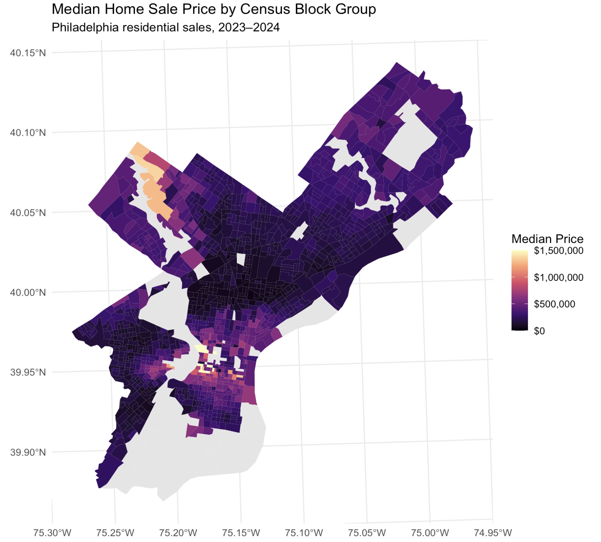
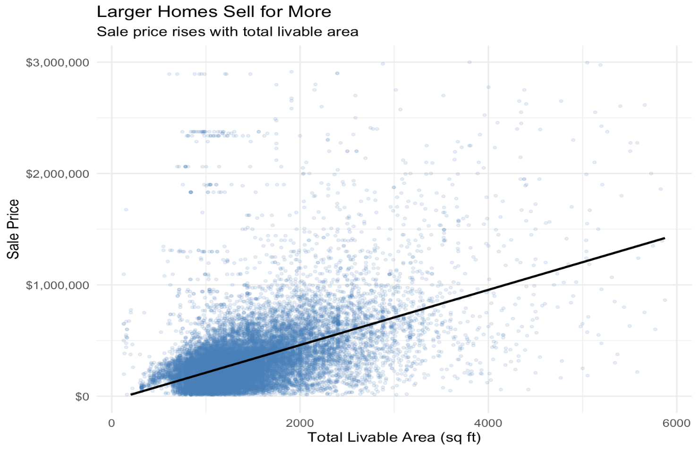
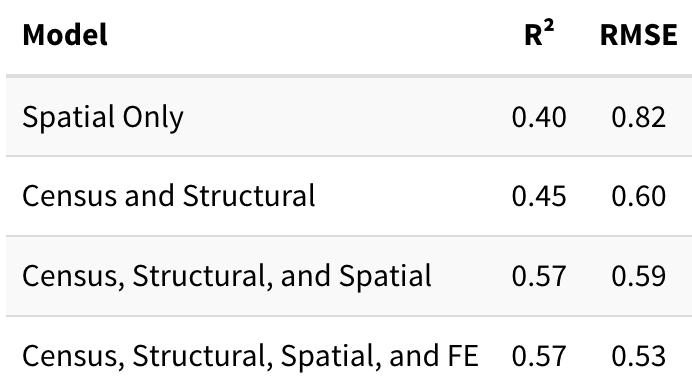
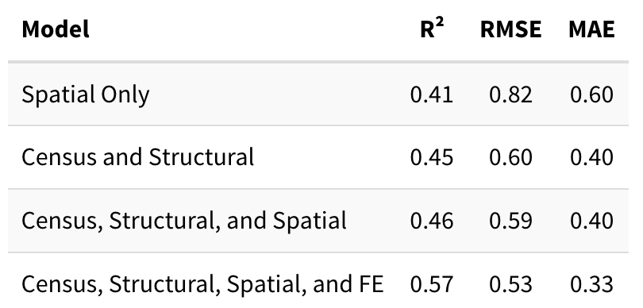
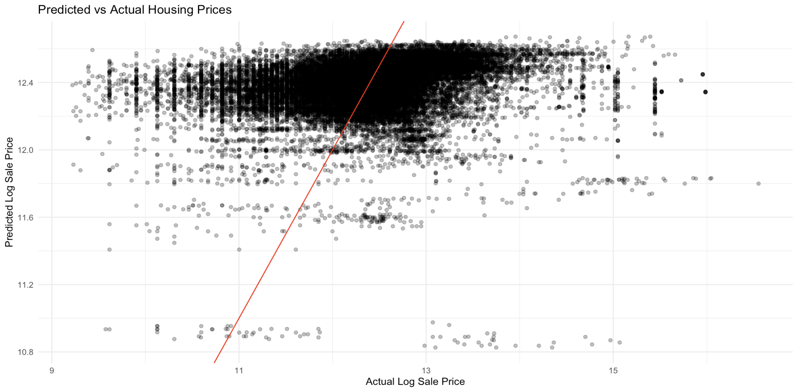

## Predicting Philly Housing Prices

**Why?**

-   Planners may use predictions to evaluate the impact of new transit developments, zoning changes, or parks on property values and affordability
-   Helps justify public investment by giving a dollar value to neighborhood amenities
-   Helps to understand urban sociological shifts and demographic changes
-   Accurate home valuation for property taxes

**How?**

-   Publicly available data
-   Using R, a free statistical software

## Data Sources

**Property Sales** from 2023-2024

-   Cleaned to only include residential properties sold above \$10000 (n = 27792)
-   Including home-level data such as square footage, bedrooms, and building type

**ACS** 5-year 2023 data at the Block Group level

-   Including Population, Median Income, Poverty, Educational Attainment, Employment, and Owner Occupancy Demographic Data

**Google Maps**

-   Philadelphia City Hall Location

## Data Sources Contd.

**OpenDataPhilly**

-   **Philadelphia Parks and Recreation** (PPR) properties for park locations
-   **SEPTA** Bus and Trolley stop locations
-   **Schools, Hospitals, Restuarants, and Crime Incidents** Locations

## Where are the Expensive Homes?

```{r}
#| echo: false
#| fig-align: center
#| out-width: "100%"

```

-   **Center City** and **Northwest Philly** have many of the highest prices, with some areas having median sale values in the \$ millions

-   Northeast Philly has median sale prices in the \~\$500,000 range

-   Higher Values in West Philly are concentrated near University City

## What Drives Prices?

```{r}
#| echo: false
#| fig-align: center
#| out-width: "100%"

```

-   **Living Area has a powerful positive correlation with home sale price**

-   In preliminary data analysis, living space came out as a key driver of housing prices

-   In our actual models, we use the natural log of sale price to achieve a more normal distribution

## Model Creation

**We made four models, each progressively more complex with varying predictive data types**

**Model 1:** Spatial Data

**Model 2:** Structural and Census Data

**Model 3:** Structural, Census, and Spatial Data

**Model 4:** Structural, Census, Spatial, and Fixed Effect Data

## Model Comparison

```{r}
#| echo: false
#| fig-align: center
#| out-width: "100%"

```

-   **Spatial Data on its own is a powerful predictor**
-   **Adding a fixed effect component to the model helped to improve predictive power -- not model fit**

## Cross Validation Results

```{r}
#| echo: false
#| fig-align: center
#| out-width: "100%"

```

-   **Model 4 has the strongest predictive ability with the lowest RMSE and MAE, and the highest R\^2**

## Full Model Performance

```{r}
#| echo: false
#| fig-align: center
#| out-width: "100%"

```

-   **The Predicted vs. Actual Values of ln Sale Price** of the model including four types of predictive data had the best RMSE and R\^2, but still has less-than-ideal predictive power

## Key Findings & Recommendations

**Model Accuracy:** RMSE = 0.53

**Top Predictors:**

-   Total Livable Area (coef = 0.0003; p \< 2e-16)
-   Median Income (coef = 0.000001; p \< 2e-06)
-   Crime Density (coef = -0.00005; p \< 0.0002)

**Worst Predictor:**

-   Distance to Transit (coef = 0.000007; p = 0.61)

## Key Findings & Recommendations

**Recommendations:**

-   Comprehensive neighborhood investment (not **just** focusing transit, green space, or crime)

-   Including interaction terms of spatial variables and income could be key improvements it may matter more in high/low income neighborhoods

-   Importance of distance to transit varies greatly in neighborhoods depending on their demographics and other spatial features

-   Census Tracts of NE Philly were difficult to predict

## Limitations & Next Steps

**Limitations and Concerns**

-   Multicollinearity

-   Variables as Proxies (e.g. crime density is dependent on police activity and arrests)

-   ACS margins of error (espacially at the block level)

-   Temporal restraint (applicable for other years?)

**Next Steps**

-   Interaction models with transit and other variables to understand verying relationships

-   Better distance metrics (walking/driving times)

-   Additional data (environmental threats, school quality)

## Questions?
